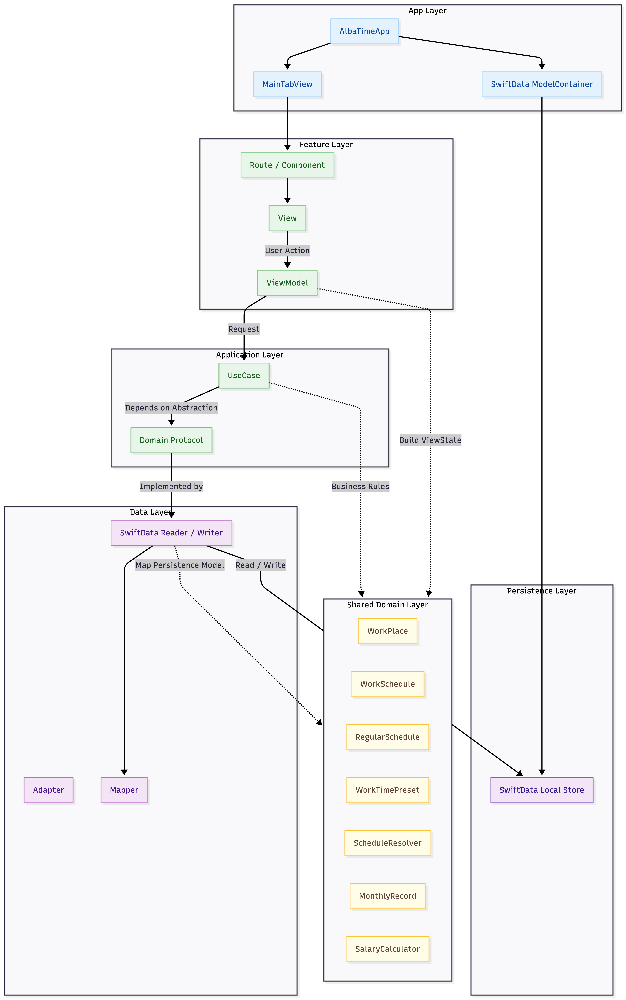
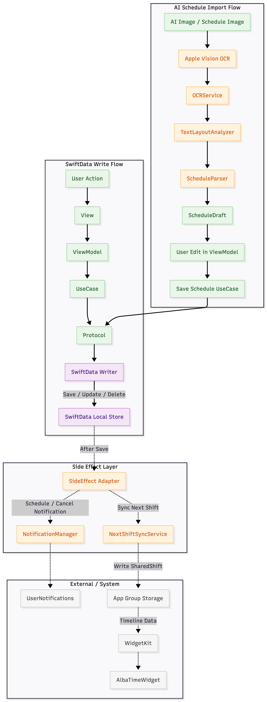

# AlbaTime (알바타임)

AlbaTime은 여러 아르바이트 근무지를 관리하고, 일정과 근무 조건을 바탕으로 월 예상 급여와 현재까지 확정된 누적 급여를 보여 주는 iOS 앱입니다. 고정·비고정 근무, 날짜별 일정 조정, 이미지 기반 일정 가져오기, 알림 및 다음 근무 위젯을 지원합니다.

## 주요 기능 (Key Features)

### 1. 급여 계산 (Salary Calculation)

- 근무지별 시급, 휴게 시간, 주휴·야간수당 적용 여부, 세금 유형을 기준으로 급여를 계산합니다.
- 누적 급여는 기준 시점까지 **근무 종료 시각이 지난** 일정만 반영합니다.
- 월 예상 급여는 날짜별 실제/조정 기록, 저장된 개별 일정, 고정 근무 패턴 순으로 일정을 해석합니다. 비고정 근무는 주간 목표 횟수와 일 평균 근무 시간을 이용해 부족분을 예측합니다.
- 주휴수당을 선택한 근무지는 주별 누적 근무시간이 15시간 이상일 때 산정하며, 야간수당은 22:00~06:00 근무분에만 반영합니다.
- 세금 공제 시뮬레이션은 미적용, 3.3% 사업소득세, 약 9.32% 4대보험 근로자 부담분을 지원합니다.

### 2. 근무지·일정·캘린더 관리 (Workplace & Schedule Management)

- 여러 근무지를 등록하고, 근무지별 고정 요일·시간 또는 비고정 근무 목표를 관리합니다.
- AI/OCR 또는 수동으로 저장한 날짜별 일정은 고정 패턴보다 우선 적용됩니다. 캘린더에서 조정한 날짜별 실제 근무 기록은 그보다도 우선합니다.
- 캘린더 상세 카드에서 선택 날짜의 근무 시간을 조정하면 급여 계산, 알림, 다음 근무 위젯에 같은 일정 해석 결과가 반영됩니다.
- 근무지, 정규 일정, 날짜별 일정·실제 기록, 시간 프리셋, 월별 실제 수령액을 SwiftData에 기기 로컬로 저장합니다.

### 3. 이미지 기반 일정 가져오기 (Apple Vision OCR)

- Apple Vision OCR로 근무표 이미지를 텍스트 박스로 인식합니다. 흐릿하거나 복잡한 이미지에 대비해 전처리한 변형 이미지를 포함한 멀티패스 인식을 수행합니다.
- 텍스트 위치를 행 단위로 분석한 뒤, 표/리스트·이름 블록·요일 매트릭스 형식을 해석합니다. 날짜, 시간 범위, 근무 프리셋 라벨을 조합해 일정 초안을 생성합니다.
- 인식 결과는 즉시 저장하지 않습니다. 사용자가 일정 초안을 편집한 뒤 저장하며, 신규 근무지 생성 중의 초안은 해당 편집 세션 안에서만 유지됩니다.

### 4. 위젯 및 알림 (Widget & Notification)

- 다음 근무 위젯은 가장 가까운 근무의 시작 시각, 남은 시간, 예정 근무시간을 표시합니다.
- 앱은 App Group UserDefaults에 다음 30일의 예정 근무 데이터를 동기화하고 `WidgetCenter`로 타임라인을 갱신합니다.
- 근무지 저장·수정·삭제 또는 캘린더의 근무시간 조정 후, 근무지별 출근 15분 전 및 근무 종료 알림을 다시 계산합니다. 앱 전체 및 근무지별 알림 설정을 모두 반영합니다.

### 5. 온보딩·분석 동의 (Onboarding & Analytics Consent)

- 근무지 등록, 이미지 일정 가져오기, 캘린더 탐색·근무시간 조정, 급여 상세의 주요 조작에는 스포트라이트 온보딩을 제공합니다.
- 첫 실행 시 Firebase Analytics 이용 동의를 받습니다. 동의하지 않아도 핵심 기능은 사용할 수 있으며, 앱이 전송하는 분석 이벤트에는 급여·근무지·메모 등 사용자가 입력한 값을 담지 않습니다.

## 설계 및 기술 스택 (Architecture & Tech Stack)

- Language: Swift 6
- Framework: SwiftUI, SwiftData, WidgetKit, UserNotifications, Vision, Firebase Analytics
- Architecture: MVVM + Feature-oriented Presentation / Application / Data / Composition layering + Protocol ports
- Persistence: SwiftData (on-device local storage)
- Widget Sync: App Groups UserDefaults + WidgetCenter timeline reload
- Minimum Target: iOS 17.6
- Project Version: 2.0.2 (build 2)
- Tools: Xcode 16+

## 아키텍처 및 데이터 흐름 (Architecture & Data Flow)

각 Feature는 화면과 상태를 맡는 Presentation, 유스케이스와 Port를 두는 Application, SwiftData/시스템 어댑터를 구현하는 Data, 의존성을 조립하는 Composition으로 나뉩니다. WorkPlace Feature에는 편집 초안과 저장 검증을 위한 Feature 내부 Domain도 있습니다.

명령성 변경은 기본적으로 `View → ViewModel → UseCase → Protocol port → SwiftData writer`로 흐릅니다. WorkPlace writer와 Calendar writer는 저장 성공 후 알림 갱신 및 다음 근무 위젯 동기화를 수행합니다. 이미지 일정 가져오기는 `ViewModel → AnalyzeScheduleImage → OCR/Parser adapter → Vision OCR·layout analyzer·schedule parser → 편집 초안` 순서이며, 사용자의 저장 요청에서만 영속화됩니다.

설계상 유의할 점도 있습니다. 이 프로젝트는 Protocol 기반의 실용적 Feature 레이어링이며, 엄격히 분리된 순수 Clean Architecture는 아닙니다. `WorkPlace` 등 공용 도메인 엔티티는 SwiftData `@Model`이고, WorkPlace·Pay·Setting의 일부 Route는 화면에 표시할 읽기 데이터를 `@Query`로 직접 주입합니다. Calendar 조회는 Reader UseCase를 통해 수행합니다.

### 폴더 구조 (Folder Structure)

```text
AlbaTime
├── App
│   ├── AlbaTimeApp.swift              # Firebase 초기화, SwiftData ModelContainer, 알림 권한 요청
│   ├── SplashView.swift               # 스플래시 및 분석 동의 화면
│   └── MainTabView.swift              # 캘린더 / 근무지 / 급여 / 설정 Route 진입점
├── Core
│   ├── DesignSystem                   # Color Theme
│   ├── Onboarding                     # 스포트라이트 온보딩 상태·UI
│   ├── UI                             # 공통 UI 컴포넌트
│   └── Util                           # Date, Haptics, KeyboardUX
├── Domain
│   ├── Payroll                        # SalaryBreakdown, MonthlyRecord, 급여 계산 서비스
│   └── Schedule                       # WorkPlace, 일정 모델, ScheduleResolver, 수당·세금 타입
├── Features
│   ├── Calendar                       # 조회·근무시간 조정 UseCase, SwiftData Reader/Writer, Route/ViewModel
│   ├── Pay                            # 급여 대시보드·월별 실제 수령액 저장/삭제
│   ├── Setting                        # 앱 알림 설정, 앱 정보·도움말·개인정보 화면
│   └── WorkPlace                      # 등록·수정·목록·이미지 일정 가져오기, Draft/Policy, Writer/Mapper/Side Effect
├── InfraStructure
│   ├── AIEngine                       # OCRService, TextLayoutAnalyzer, ScheduleParser
│   ├── FirebaseAnalytics              # 동의 상태, 이벤트, Firebase tracker
│   ├── Notifications                  # NotificationManager
│   └── WidgetSync                     # NextShiftSyncService, SharedShift
├── Document
│   └── PRIVACY.md                     # 개인정보처리방침 원문
└── Resources
    └── Assets.xcassets                # 앱 아이콘, 색상, 이미지 리소스

AlbaTimeWidget
└── Widget                             # 다음 근무 위젯, Timeline Provider, App Group Repository, View/ViewModel

AlbaTimeTests
├── WorkPlaceDataFlowTests.swift       # WorkPlace UseCase/ViewModel/초안 흐름
├── SalaryCalculatorTests.swift        # 급여·주휴·일정 우선순위 계산
└── OnboardingStoreTests.swift         # 온보딩 상태 저장·초기화
```

## 아키텍처 / 데이터 플로우

아래 이미지는 현재 구조를 설명하는 개념도입니다. 코드와 비교했을 때 두 흐름의 핵심은 일치하지만, 첫 번째 그림은 `AlbaTimeApp → SplashView → 분석 동의 → MainTabView` 진입 단계와 Route의 `@Query` 기반 읽기 주입을 생략합니다. 또한 Calendar의 근무시간 조정 writer도 WorkPlace writer와 동일하게 저장 뒤 알림·위젯을 갱신합니다.

### App Architecture Flow


### SwiftData Write & Side Effect Flow



## 실제 구현 화면
   


## V1.0.0 개발기간
2025.12.8 ~ 2026.1.13

## V1.1.0 개발기간
2026.1.13 ~ 2026.1.24

업데이트
```text
1. Vision 기반 AI OCR 엔진 탑재
2. 고정/자율 스케줄을 분리하여 저장 가능하도록 업데이트
```
## V1.2.0 개발기간
2026.1.24 ~ 2026.2.18

업데이트
```text
1. AI 스케줄 관리 개선
   1-1) 월/주차 기준으로 AI 스케줄 저장 및 불러오기 구조 정리
   1-2) 저장된 AI 스케줄을 주차 단위로 수정할 수 있는 편집 흐름 추가
   1-3) 근무지별로 AI 스케줄 데이터가 분리 관리되도록 개선
2. OCR 인식 안정화
   2-1) 단일 OCR 인식에서 멀티패스 인식 및 후처리 병합으로 변경하여 OCR 인식률 개선
3. 급여 계산 로직 개선
   3-1) 월 예상 금액 중심에서 실제 누적 금액 중심으로 계산 흐름 개선
   3-2) 근무 종료 시점 기준 누적 반영 로직 적용
   3-3) 휴게시간/수당 반영 분기 정리 및 계산 정확도 개선
4. 위젯 개발
   4-1) 다음 근무 정보 위젯 추가
   4-2) 앱 데이터와 위젯 간 동기화 로직 적용
   4-3) 위젯 표시 텍스트 및 시간 계산 로직 개선
5. 근무지/캘린더 동기화 개선
   5-1) AI로 저장한 스케줄이 캘린더에 주차 기준으로 반영되도록 개선
   5-2) 고정근무/자율근무 모두 동일한 동기화 흐름으로 정리
   5-3) 스케줄 수정 후 캘린더/알림 갱신 안정성 강화
6. UI/UX 개선
   6-1) AI 스케줄 화면의 주차 선택/편집 UI 개선
   6-2) 요일 선택 기반 단일 카드 편집 방식 도입
   6-3) 화면 이동 흐름 및 저장 후 복귀 동작 정리
7. 버그 수정
   7-1) AI 스케줄 저장/수정 시 반영 누락 문제 수정
   7-2) 자율근무에서 저장 실패하던 케이스 수정
   7-3) 위젯/근무시간 표시 관련 예외 케이스 수정
```
## V1.2.1 개발기간
2026.2.18 ~ 2026.3.1

업데이트
```text
1. 캘린더 탐색 UX 개선
   1-1) 월간 캘린더에서 좌우 스와이프로 월 이동이 가능하도록 개선
   1-2) 연도 / 월을 버튼형으로 구성해 원하는 시점으로 더 빠르게 이동할 수 있도록 개선

2. 급여 화면 인터랙션 개선
   2-1) 급여 카드 전환 애니메이션을 더 자연스럽게 수정
   2-2) 카드 전환 힌트 문구를 추가해 사용자가 기능을 더 쉽게 인지할 수 있도록 개선
   2-3) 카드 전환 시 햅틱 피드백을 적용해 조작감을 강화
   2-4) 월 예상 수령액이 함께 보이도록 카드 구성 및 계산 로직 보완

3. 근무지 등록 / 수정 UX 개선
   3-1) AddJobView 입력 화면에서 키보드 툴바로 이전 / 다음 필드 이동이 가능하도록 개선
   3-2) 키보드 완료 버튼을 checkmark 형태로 정리해 입력 흐름을 단순화
   3-3) 저장하지 않고 화면을 나갔을 때 수정 내용이 반영되던 버그 수정

4. 근무 상세 및 기록 화면 보완
   4-1) 상세보기 화면에서 기존 근무 시간이 보이지 않던 문제 수정
   4-2) 자율 근무제 환경을 고려해 상세 정보 노출 방식 보완
   4-3) 기록 화면에 삭제 안내 문구를 추가해 사용성 개선

5. 다크 모드 대응
   5-1) 주요 화면 색상 구조를 정리해 다크 모드 1차 대응
   5-2) 위젯 포함 일부 화면의 다크 모드 색상 및 대비 개선
   5-3) 잘못 누적된 패딩 및 레이아웃 문제를 함께 수정

6. 안정성 및 기타 개선
   6-1) 알림 처리 과정에서 발생할 수 있던 크래시 가능성을 줄이도록 참조 구조 개선
   6-2) FAQ 및 도움말 문구를 더 자연스럽게 수정
   6-3) 말풍선 위치, 카드 전환 연출 등 세부 UI 디테일 보정
```
## V2.0.0 개발기간
2026.3.1 ~ 2026.6.19

업데이트
```text
1. 프로젝트 아키텍처 대규모 리팩토링
   1-1) Job 기능을 Presentation / Application / Domain / Data / Composition 계층으로 분리
   1-2) ViewModel이 SwiftData에 직접 의존하던 흐름을 UseCase + Protocol 기반으로 정리
   1-3) 저장, 수정, 삭제, 핀 고정, 알림 토글, 메모 수정 로직을 명령형 UseCase로 분리
   1-4) JobFeatureComposition을 통해 화면에서 필요한 의존성을 한 곳에서 조립하도록 개선
2. 근무지 저장 및 수정 흐름 개선
   2-1) 신규 근무지 등록과 기존 근무지 편집 흐름을 JobEditingSession 기반으로 통합
   2-2) 고정 근무와 자율 근무 저장 로직을 SaveFixedJob / SaveFlexibleJob으로 분리
   2-3) 근무지 저장 검증 로직을 JobSaveValidator로 분리하여 이름, 시급, 고정 스케줄 누락 케이스 처리
   2-4) 근무지 수정 시 기존 AI 스케줄, 휴게시간, 기본 메모가 유지되도록 편집 Seed 구조 추가
3. AI 스케줄 가져오기 구조 개선
   3-1) OCR 결과를 ScheduleEditDraft / ScheduleDraftItem 기반의 편집 가능한 초안으로 관리
   3-2) 신규 근무지 생성 중 가져온 AI 스케줄은 즉시 DB 저장하지 않고 세션 내부에 보관
   3-3) 기존 근무지 AI 스케줄 추가/수정/삭제는 SaveScheduleUseCase를 통해 SwiftData에 반영
   3-4) 저장된 AI 스케줄을 주차 단위로 불러오고 단일 카드 방식으로 수정할 수 있도록 UI 흐름 개선
4. OCR 및 스케줄 파싱 안정화
   4-1) Apple Vision 기반 OCR을 멀티패스 방식으로 개선
   4-2) 흑백화, 2배 확대, 대비 조정, 선명도 보정 등 이미지 전처리 추가
   4-3) OCR confidence, 텍스트 위치, 문자열 유사도 기반 중복 병합 로직 추가
   4-4) 표 형식, 리스트 형식, 이름 기준 블록, 요일 매트릭스 형식 스케줄 파싱 지원
   4-5) 프리셋 라벨과 시간 범위를 함께 인식하여 AI 스케줄 저장 정확도 개선
5. 급여 계산 로직 개선
   5-1) 월 전체 예상 급여와 현재 시점 기준 누적 급여 계산을 분리
   5-2) 근무 종료 시각이 지난 스케줄만 누적 급여에 반영
   5-3) 고정 근무는 실제 기록과 정규 패턴을 함께 계산하고, AI로 대체된 주차는 중복 예측 제외
   5-4) 자율 근무는 실제 기록과 주간 목표 횟수/평균 시간을 조합해 부족분만 예측
   5-5) 주휴수당, 야간수당, 세금 공제 흐름을 SalaryBreakdown 기준으로 정리
6. 캘린더/근무지/알림 동기화 개선
   6-1) ScheduleResolver를 통해 특정 날짜의 실제 기록, AI 기록, 고정 패턴 우선순위 정리
   6-2) 저장/수정/삭제 이후 알림과 위젯 데이터가 함께 갱신되도록 SwiftData Writer에서 사이드이펙트 처리
   6-3) 출근 15분 전 알림과 근무 종료 알림을 다가오는 30일 스케줄 기준으로 등록
   6-4) 근무지별 알림 on/off 및 앱 전체 알림 설정 흐름 개선
7. 위젯 기능 개선
   7-1) App Group 기반으로 앱과 위젯 간 다음 근무 데이터를 공유
   7-2) NextShiftWidget에서 다음 근무까지 남은 시간과 시작 시각 표시
   7-3) 근무지 저장/수정 후 WidgetCenter timeline reload 적용
   7-4) 고정 근무 패턴과 수동/AI 스케줄을 함께 고려해 다음 근무 계산
8. 테스트 코드 정리
   8-1) JobDataFlowTests 추가
   8-2) SaveJobUseCase, AddJobViewModel, JobListViewModel, ScheduleImportViewModel의 데이터 흐름 검증
   8-3) Protocol 기반 Spy 객체를 사용해 SwiftData 없이 UseCase/ViewModel 단위 테스트 가능하도록 개선
```
## V2.0.1 개발기간
2026.6.19 ~ 2026.7.4

업데이트
```text
1. Feature 단위 프로젝트 구조 정리
   1-1) Job 명칭을 실제 도메인에 맞춰 WorkPlace 중심 구조로 정리
   1-2) WorkPlace, Calendar, Pay, Setting 폴더를 기능 단위로 재구성
   1-3) Feature 내부 폴더명을 Application / Data / Presentation / Composition 기준으로 통일
   1-4) Protocol, UseCase, View, ViewModel, Component, Route 등 하위 폴더명을 단수형으로 정리

2. Protocol-Oriented Clean Architecture 적용 범위 확장
   2-1) Calendar, Pay, Setting 기능도 WorkPlace와 같은 계층 구조를 따르도록 개선
   2-2) ViewModel이 직접 저장소나 외부 객체를 다루던 흐름을 UseCase + Protocol 기반으로 정리
   2-3) 화면에서 필요한 의존성은 Feature별 Composition에서 조립하도록 개선
   2-4) SwiftData 접근은 각 Feature의 Data 계층으로 이동

3. 공통 데이터 접근 계층 제거
   3-1) 기존 DataBaseAccess 폴더 제거
   3-2) AppDataProvider / AppWriteCoordinator 의존 흐름 제거
   3-3) Calendar는 SwiftData Reader, Pay는 SwiftData Writer 방식으로 Feature 내부에서 데이터 접근 처리

4. Setting 구조 정리
   4-1) Setting 화면을 SettingHome, AppInfo, Help, PersonalInfo, Shared 기준으로 분리
   4-2) 앱 알림 토글 흐름을 ToggleAppAlarm UseCase와 AppAlarmProtocol로 분리
   4-3) 카카오톡 오픈채팅 링크는 Shared SettingExternalLink로 공통 관리

5. 프로젝트 명명 규칙 정리
   5-1) Settings를 Setting으로 정리
   5-2) AI Engine을 AIEngine으로 정리
   5-3) Infrastructure를 실제 폴더명인 InfraStructure 기준으로 문서화
   5-4) WorkPlaceDataFlowTests 기준으로 테스트 문서 최신화
```

## V2.0.2 개발기간
2026.7.5 ~ 2026.8.6

업데이트
```text
1. 캘린더 일정 조정 및 일관된 일정 해석
   1-1) 캘린더 상세 카드에서 날짜별 근무 시작·종료 시간을 조정하고 WorkRecord로 저장하는 흐름 추가
   1-2) 일정 우선순위를 날짜별 실제/조정 기록 → 저장된 개별 일정(AI·수동) → 고정 근무 패턴으로 통합
   1-3) 근무시간 조정 후 급여, 출근·종료 알림, 다음 근무 위젯이 같은 해석 결과를 사용하도록 동기화

2. 급여 계산 모듈화 및 계산 정책 보완
   2-1) 월 급여 계산을 근무시간, 급여 금액, 주휴수당, 월별 계산 서비스로 분리
   2-2) 고정·비고정 근무의 월 예상 금액과 종료된 근무만 반영하는 누적 금액을 각각 검증
   2-3) 주별 근무시간에 따른 주휴수당 상한과 휴게시간·야간근무 반영을 테스트로 보완

3. 온보딩 및 캘린더 탐색 경험 추가
   3-1) 근무지, 이미지 일정 가져오기, 캘린더, 급여 상세의 주요 조작에 스포트라이트 온보딩 추가
   3-2) 캘린더의 연·월 선택, 좌우 스와이프 이동, 날짜별 근무시간 조정 흐름 보완

4. 분석 동의 및 개인정보 안내
   4-1) Firebase Analytics를 연동하고 앱 시작 시 분석 이용 동의 화면 추가
   4-2) 동의 여부에 따라 Analytics 수집을 제어하고, 사용자 입력값을 이벤트 파라미터로 전송하지 않도록 구성
   4-3) 앱 내 개인정보처리방침 화면과 원문 문서 추가

5. 구조·테스트 정리
   5-1) 공통 UI/유틸리티와 온보딩 모듈을 Core로 정리
   5-2) SalaryCalculatorTests에 누적·예상 급여, 주휴수당, 일정 우선순위 테스트 추가
   5-3) WorkPlaceDataFlowTests에 저장된 AI/수동 일정과 신규 근무지 편집 세션 흐름 검증 추가
```
